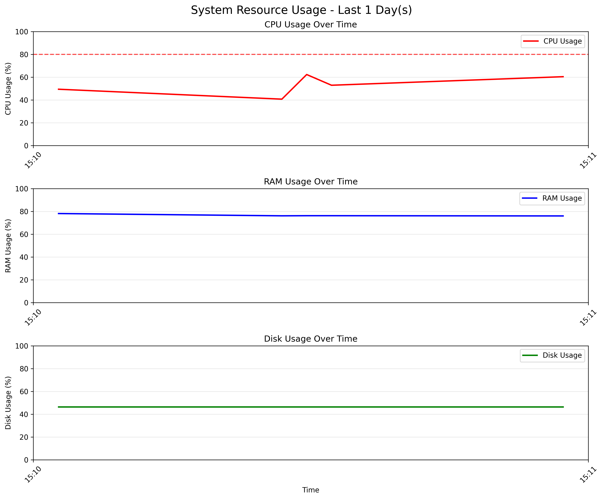

# 🚀 AutoSysMonitor

> A lightweight, modular system monitoring tool for Linux with real-time logging, alerting, visualization, and CLI control — built with Python.


---

## 📌 Overview

**AutoSysMonitor** is a Python-based CLI tool that continuously tracks and logs your system's CPU, RAM, and Disk usage. Designed for Linux environments, it includes automatic alerting for high CPU usage, log rotation, gzip compression, and visual trend analysis — all wrapped in a simple command-line interface. It's ideal for system admins, developers, or students learning Linux system resource management.

---

## 🧩 Features

### 🔍 Real-Time Monitoring
- ⏱️ Logs CPU, RAM, and Disk usage every 60 seconds with timestamps
- ⚠️ Intelligent alerting for CPU usage exceeding 80%
- 🧾 Metrics saved to `syslog.txt`, and alerts written to `alerts.txt`

### 📁 Log Management
- 🔄 Auto-rotates logs older than 3 days or larger than 1MB
- 📦 Compresses rotated logs using `.gz` format
- 🕒 Creates backups with timestamps for safe archival

### 📊 Visualization & Stats
- 📈 Generates line charts of CPU and RAM usage over time
- 📊 Combines multiple system resources in one plot
- 📃 Supports statistical summaries over selected log periods

### 💻 CLI Interface
| Command                  | Description                            |
|--------------------------|----------------------------------------|
| `python main.py start`   | Start system monitoring                |
| `python main.py plot`    | Generate visual plots from logs        |
| `python main.py status`  | Show current CPU, RAM, Disk snapshot   |
| `python main.py rotate`  | Manually rotate and compress logs      |

---

## 🔧 Installation

### 🧱 Requirements
- Linux Operating System
- Python 3.6 or higher

### 📦 Install Dependencies
```
pip install psutil matplotlib
```

## 📸 Sample Output

Here’s an example of the CPU and RAM usage visualization:



---

## 💡 Possible Enhancements (Contributions Welcome!)

- 📧 **Email Alerts**: Notify users via email when CPU or RAM crosses a critical threshold.
- 📊 **Disk Usage Plotting**: Visualize disk usage trends alongside CPU and RAM.
- 🌐 **Web Dashboard**: Add a Flask-based web interface to monitor system health in real time.
- 🐳 **Docker Support**: Containerize the app for easier deployment and isolation.

---

## 📘 License

This project is licensed under the **MIT License**.  
You are free to use, modify, and distribute it with proper attribution.

---


